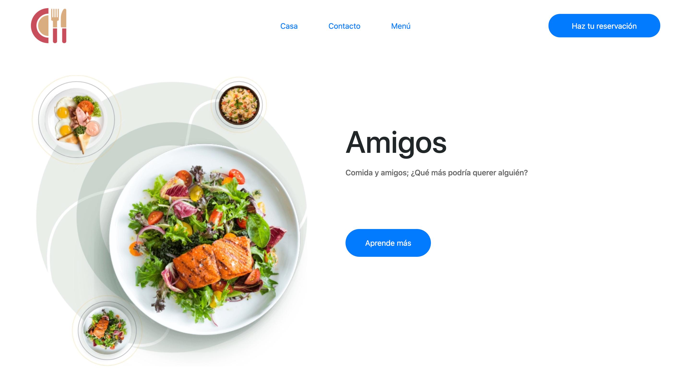

# Restaurant: Amigos

> This project is a single-page website for a fictional website called "Amigos", which was built as part of Microverse's JavaScript module.

The purpose of this project is demonstrate competence in using npm and webpack, as well as further developing my skills in DOM manipulation and writing clean and modular JS code.

All the content on the website has been added via JavaScript, and a tab system has been implemented using event listeners to allow the user to switch between "Home", "Contact" and "Menu" views.

## Built With

- JavaScript
- npm (Node Package Manager)
- Webpack
- Sass
- Bootstrap

## Getting Started

To get a local copy up and running follow these simple example steps.

### Prerequisites

### Setup

To set this project up locally, follow these simple instructions:

1. Open a Terminal and navigate to the location in your system where you would like to download the project. **New to Terminal? [Learn here](https://www.freecodecamp.org/news/conquering-the-command-line-f85f5e46c07c/).**

2. Enter the following line of code to clone this repository:

`git clone git@github.com:Joseph-Burke/Restaurant.git`

3. Now that the repository has been cloned, navigate inside it using `cd Restaurant`.

4. The project's dependencies are managed by npm. To install them, enter the following line of code in the Terminal.

`npm install`

5. Congratulations! All necessary files have been installed. To view the website, just open 'dist/index.html' in a browser of your choosing.

## Author

👤 **Joseph Burke**

  **Say hello! I don't bite.**

- Github: [@Joseph-Burke](https://github.com/Joseph-Burke)
- Twitter: [@__joeburke](https://twitter.com/__joeburke)
- LinkedIn: [Joseph Burke](https://www.linkedin.com/in/joseph-burke-b7a8261a5)

## 🤝 Contributing

Contributions, issues and feature requests are welcome!

Feel free to check the [issues page](issues/).

## Show your support

Give a ⭐️ if you like this project!

## Acknowledgments

- While the front-end was not the focus of this project, I chose to model this website on [a design from Dribbble](https://dribbble.com/shots/11741059-Food-landing-Page). Thanks to [Sarwar Ahmed](https://dribbble.com/sarwar_ms) from [iSketch Studio](https://dribbble.com/isketch_studio).
- Many thanks to all of my peers and colleagues from Microverse.
- This assignment was taken from [The Odin Project](https://www.theodinproject.com/home)'s Web Development course, which is available for free.

## 📝 License

This project is [MIT](lic.url) licensed.
